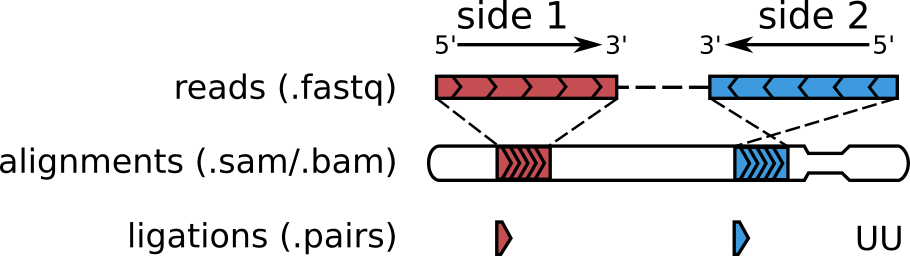
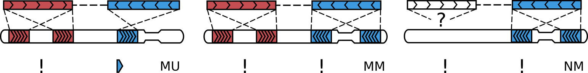
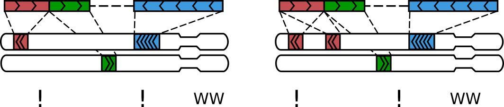
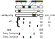
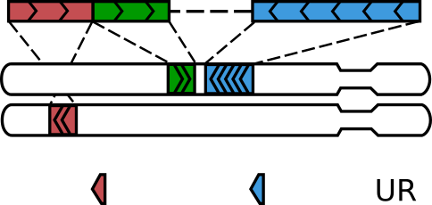
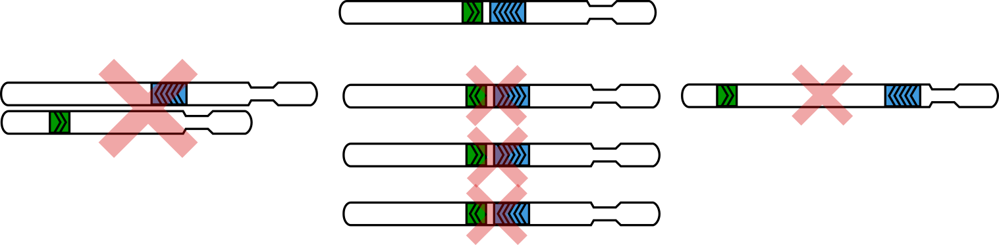
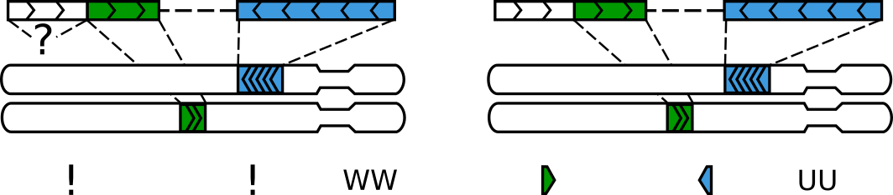
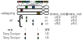
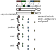
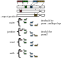

Parsing sequence alignments into Hi-C pairs
===========================================

Overview
--------

Hi-C experiments aim to measure the frequencies of contacts between all pairs
of loci in the genome. In these experiments, the spacial structure of chromosomes 
is first fixed with formaldehyde crosslinks, after which DNA is partially
digested with restriction enzymes and then re-ligated back. Then, DNA is 
shredded into smaller pieces, released from the nucleus, sequenced and aligned to
the reference genome. The resulting sequence alignments reveal if DNA molecules 
were formed through ligations between DNA from different locations in the genome.
These ligation events imply that ligated loci were close to each other
when the ligation enzyme was active, i.e. they formed "a contact".

``pairtools parse`` detects ligation events in the aligned sequences of 
DNA molecules formed in Hi-C experiments and reports them in the .pairs/.pairsam 
format.

Terminology 
-----------

Throughout this document we will be using the same visual language to describe
how DNA sequences (in the .fastq format) are transformed into sequence alignments 
(.sam/.bam) and into ligation events (.pairs).

   DNA sequences (reads) are aligned to the reference genome and converted into
   ligation events

Short-read sequencing determines the sequences of the both ends (or, **sides**)
of DNA molecules (typically 50-300 bp), producing **read pairs** in .fastq format 
(shown in the first row on the figure above).
In such reads, base pairs are reported from the tips inwards, which is also
defined as the **5'->3'** direction (in accordance of the 5'->3' direction of the
DNA strand that sequence of the corresponding side of the read).

Alignment software maps both reads of a pair to the reference genome, producing
**alignments**, i.e. segments of the reference genome with matching sequences.
Typically, if the read length is not very large (< 150 bp), there will be only
two alignments per read pair, one on each side. But, sometimes, the parts of one
or both sides may map to different locations on the genome, producing more than
two alignments per DNA molecule (see :ref:`section-walks`).

``pairtools parse`` converts alignments into **ligation events** (aka
**Hi-C pairs** aka **pairs**). In the simplest case, when each side has only one 
unique alignment (i.e. the whole side maps to a single unique segment of the 
genome), for each side, we report the chromosome, the genomic position of the
outer-most (5') aligned base pair and the strand of the reference genome that 
the read aligns to.  ``pairtools parse`` assigns to such pairs the type ``UU``
(unique-unique).

Unmapped/multimapped reads
--------------------------

Sometimes, one side or both sides of a read pair may not align to the 
reference genome:

   Read pairs missing an alignment on one or both sides

In this case, ``pairtools parse`` fills in the chromosome of the corresponding
side of Hi-C pair with ``!``, the position with ``0`` and the strand with ``-``.
Such pairs are reported as type ``NU`` (null-unique, when the other side has
a unique alignment) or ``NN`` (null-null, when both sides lack any alignment).

Similarly, when one or both sides map to many genome locations equally well (i.e.
have non-unique, or, multi-mapping alignments), ``pairtools parse`` reports 
the corresponding sides as (chromosome= ``!``, position= ``0``, strand= ``-``) and 
type ``MU`` (multi-unique) or ``MM`` (multi-multi) or ``NM`` (null-multi),
depending on the type of the alignment on the other side.

   Read pairs with a non-unique (multi-) alignment on one side
   
``pairtools parse`` calls an alignment to be multi-mapping when its
`MAPQ score <https://bioinformatics.stackexchange.com/questions/2417/meaning-of-bwa-mem-mapq-scores>`_
(which depends on the scoring gap between the two best candidate alignments for a segment)
is equal or greater than the value specied with the ``--min-mapq`` flag (by default, 1).

.. _section-walks:

Multiple ligations (walks)
--------------------------

If the read is long enough (e.g. larger than 150 bp), it may contain more than two alignments:

   A sequenced Hi-C molecule that was formed via multiple ligations

Molecules like these typically form via multiple ligation events and we call them
walks [1]_. The mode of walks reporting is controlled by ``--walks-policy`` parameter of ``pairtools parse``.
You can report all the alignments in the reads by using ``pairtools parse2`` (see :ref:`parse2`).

A pair of sequential alignments on a single read is **ligation junction**. Ligation junctions are the Hi-C contacts
that have been directly observed in the experiment. However, traditional Hi-C pairs do not have direct evidence of ligation
because they arise from read pairs that do not necessarily contain ligation junction.
To filter out the molecules with complex walks, ``--walks-policy`` can be set to:

- ``mask`` to tag these molecules as type ``WW`` (single ligations are rescued, see :ref:`Rescuing single ligations`),
- ``5any`` to report the 5'-most alignment on each side,
- ``5unique`` to report the 5'-most unique alignment on each side,
- ``3any`` to report the 3'-most alignment on each side,
- ``3unique`` to report the 3'-most unique alignment on each side,
- ``all`` to report all sequential alignments (complex ligations are rescued, see :ref:`Rescuing complex walks`).

Parse modes for walks:

Rescuing single ligations
-------------------------

Importantly, some of DNA molecules containing only one ligation junction
may still end up with three alignments:

   Not all read pairs with three alignments come from "walks"

A molecule formed via a single ligation gets three alignments when one of the 
two ligated DNA pieces is shorter than the read length, such that that read on 
the corresponding side sequences through the ligation junction and into the other 
piece [2]_. The amount of such molecules depends on the type of the restriction 
enzyme, the typical size of DNA molecules in the Hi-C library and the read 
length, and sometimes can be considerable.

``pairtools parse`` detects such molecules and **rescues** them (i.e.
changes their type from a *walk* to a single-ligation molecule). It tests
walks with three aligments using three criteria:

   The three criteria used to "rescue" three-alignment walks: cis, point towards each other, short distance

1. On the side with two alignments (the **chimeric** side), the "inner" (or, 3') 
   alignment must be on the same chromosome as the alignment on the non-chimeric
   side.

2. The "inner" alignment on the chimeric side and the alignment on the 
   non-chimeric side must point toward each other.

3. These two alignments must be within the distance specified with the
   ``--max-molecule-size`` flag (by default, 2000bp).

Sometimes, the "inner" alignment on the chimeric side can be non-unique or "null" 
(i.e. when the unmapped segment is longer than ``--max-inter-align-gap``, 
as described in :ref:`Interpreting gaps between alignments`). ``pairtools parse`` ignores such alignments
altogether and thus rescues such *walks* as well.

.. figure:: _static/read_pair_UR_MorN.png
   :scale: 50 %
   :alt: A walk with three alignments get rescued, when the middle alignment is multi- or null
   :align: center

   A walk with three alignments get rescued, when the middle alignment is multi- or null.

Interpreting gaps between alignments
------------------------------------

Reads that are only partially aligned to the genome can be interpreted in
two different ways. One possibility is to assume that this molecule
was formed via at least two ligations (i.e. it's a *walk*) but the non-aligned
part (a **gap**) was missing from the reference genome for one reason or another.
Another possibility is to simply ignore this gap (for example, because it could
be an insertion or a technical artifact), thus assuming that our
molecule was formed via a single ligation and has to be reported:

   A gap between alignments can interpeted as a legitimate segment without
   an alignment or simply ignored

Both options have their merits, depending on a dataset, quality of the reference
genome and sequencing. ``pairtools parse`` ignores shorter *gaps* and keeps
longer ones as "null" alignments. The maximal size of ignored *gaps* is set by
the ``--max-inter-align-gap`` flag (by default, 20bp).

Rescuing complex walks
-------------------------

We call the multi-fragment DNA molecule that is formed during Hi-C (or any other chromosome capture with sequencing) a walk.
If the reads are long enough, the right (reverse) read might read through the left (forward) read.
Thus, left read might span multiple ligation junctions of the right read.
The pairs of contacts that overlap between left and right reads are intermolecular duplicates that should be removed.

If the walk has no more than two different fragments at one side of the read, this can be rescued with simple
``pairtools parse --walks-policy mask``. However, in complex walks (two fragments on both reads or more than two fragments on any side)
you need specialized functionality that will report all the deduplicated pairs in the complex walks.
This is especially relevant if you have the reads length > 100 bp, since more than 20% or all restriction fragments in the genome are then shorter than the read length.
We put together some statistics about number of short restriction fragments for DpnII enzyme:

======== ================= ================== ================== ================== ==================
 Genome   #rfrags <50 bp          <100 bp            <150 bp             <175 bp           <200 bp
-------- ----------------- ------------------ ------------------ ------------------ ------------------
  hg38     828538 (11.5%)    1452918 (20.2%)    2121479 (29.5%)    2587250 (35.9%)    2992757 (41.6%)
  mm10     863614 (12.9%)    1554461 (23.3%)    2236609 (33.5%)    2526150 (37.9%)    2780769 (41.7%)
  dm3      65327 (19.6%)     108370 (32.5%)     142662 (42.8%)     156886 (47.1%)     169339 (50.9%)
======== ================= ================== ================== ================== ==================

Consider the read with overlapping left and right sides:

``pairtools`` can detect such molecules and parse them.
Briefly, we detects all the unique ligation junctions, and do not report the same junction as a pair multiple times.
To parse complex walks, you may use ``pairtools parse --walks-policy all`` and ``parse2``, which have slightly different functionalities.

``pairtools parse --walks-policy all`` is used with regular paired-end Hi-C, when you want
all pairs in the walk to be reported as if they appeared in the sequencing data independently.

``parse2`` is used with single-end data or when you want to customize your reporting (orientation, position of alignments, or perform combinatorial expansion).
For example, ``parse2`` defaults to reporting ligation junctions instead of outer ends of the alignments.

The complete guide through the reporting options of ``parse2``, orientation:

position:

Sometimes it is important to restore the sequence of ligation events (e.g., for MC-3C data). For that, you can add
special columns ``walk_pair_index`` and ``walk_pair_type`` by setting ``--add-pair-index`` option of ``parse2``, that will keep the order and type of pair in the whole walk in the output .pairs file.

- ``walk_pair_index`` contains information on the order of the pair in the complex walk, starting from 5'-end of left read
- ``walk_pair_type`` describes the type of the pair relative to R1 and R2 reads of paired-end sequencing:

  - "R1-2" - unconfirmed pair, right and left alignments in the pair originate from different reads (left or right). This might be indirect ligation (mediated by other DNA fragments).
  - "R1" - pair originates from the left read. This is direct ligation.
  - "R2" - pair originated from the right read. Direct ligation.
  - "R1&2" - pair was sequenced at both left and right read. Direct ligation.
With this information, the whole sequence of ligation events can be restored from the .pair file.

Combinatorial expansion is a way to increase the number of contacts in you data, which assumes that all DNA fragments
in the same molecule (read) are in contact. Use ``--expand`` parameter for combinatorial expansion.
Note that expanded pairs have modified pair type, "E{separation}_{pair type}", e.g.:

- "E1_R1" is a pair obtained by combining left alignment of some pair in R1 read and right alignment of the next pair in R1 sequence of the same read.
- "E2_R1" is a pair obtained by combining left alignment of some pair in R1 read and right alignment of the pair separated by 2 alignments in R1 sequence of the same read.
- "E2_R1&2" as above, both source pairs were sequenced on both R1 and R2.
- "E4_R1-2" is a pair obtained by combining left alignment of some pair in R1 read and right alignment of some pair in R1 sequence, separated by at least 4 alignments in between.
Note that "-" in the pair type means that pair is separated by unsequenced gap, which may contain other pairs.

Aligner settings
-----------------

We recommended using local DNA sequence aligners, such as `BWA-MEM <http://bio-bwa.sourceforge.net/>`_ and `Bowtie2 <http://bowtie-bio.sourceforge.net/bowtie2/index.shtml>`_ (in the local alignment mode), 
as opposed to global aligners (e.g. Bowtie2 in the end-to-end mode). 
Local aligners assume that DNA molecules may contain fragments aligning to different locations in the genome and thus are better suited for mapping chimeric Hi-C molecules.

Aligning Hi-C reads may further require adjusting aligner settings.
Some aligners assume DNA libraries contain only contiguous fragments, leading to 'mate rescue' where one read's alignment is modified or even forced based on its pair's alignment. 
This behavior is incompatible with Hi-C, which produces chimeric molecules with unrelated alignments on each side. 
To avoid erroneous results, disable mate rescue/pairing and align reads pairs independently. 
In `bwa mem`, use the '-SP' flags to achieve this.

.. [1] Following the lead of `C-walks <https://www.nature.com/articles/nature20158>`_

.. [2] This procedure was first introduced in `HiC-Pro <https://github.com/nservant/HiC-Pro>`_ 
   and the in `Juicer <https://github.com/theaidenlab/juicer>`_ .
